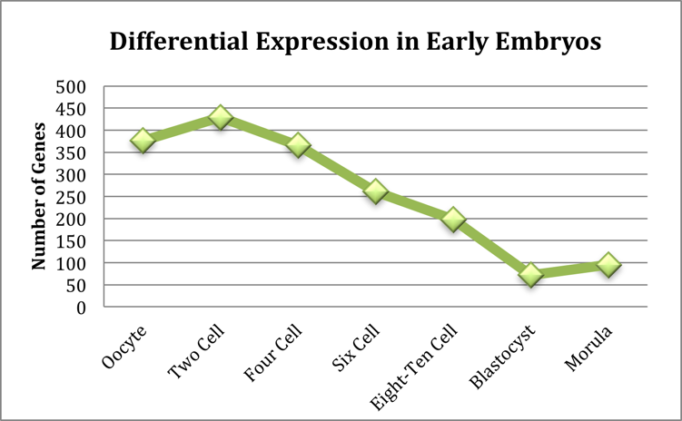

# Reasons Underlying the High Failure Rate of In Vitro Fertilization: An Investigation of the Differentially Regulated Transcripts in the Pre-implantation Embryo

Heather Hall

March 15, 2013

### ABSTRACT 

Early embryonic development exhibits the high incidence of aneuploidy and embryo failure and, in fact, embryo developmental errors are the most common cause of birth defects. As such, it is critical to decipher these basic developmental and reprogramming pathways and reasons for their failure. Insight into the pre-implantation embryo transcriptome may elucidate some of the causes of this failure. Here, microarray data from Vasenna et al. of early stage embryos is used to uncover gene candidates responsible for embryo instability. [1] This study reveals that genes involved in microtubule polymerization and movement are differentially regulated compared with embryonic stem cells in the pre-implantation embryo. Due to the importance of microtubules in mitosis, this suggests a possible mechanism leading to high aneuploidy rates in early embryos.

### INTRODUCTION 
Human embryo development begins with reprogramming of the pronuclei from sperm and egg programs to totipotent embryonic programs. Cellular reprogramming is required in early human embryonic development and the subsequent differentiation to mature somatic lineages, making it an essential process in human development. As evident by the human population, this process can be exceedingly successful; however, research has begun to demonstrate the many ways this process can fail and how frequently the process does fail. Human embryos have been shown to exhibit increased chromosomal abnormalities, sensitivity to DNA damage, and programmed cell death. [1,2,3,4]  In accordance with this observation, in vivo and in vitro reprogramming efficiencies are very low and genetic instability is quite common. [1,5] In an effort to better understand embryonic development and is failures, the Reijo Pera lab have developed non-invasive imaging methods for predicting successful embryos. [5] By observing timescales for various cell division events, the imaging method is able to predict with more than 93% sensitivity, which pre-implantation embryos for in vitro fertilization will successfully progress to the blastocyst stage. [5]

The first few stages of embryonic development, especially pre-implantation embryos, exhibit the high incidence of aneuploidy and embryo failure previously mentioned. This property of embryos results in low-success rates of in vitro fertilization (IVF). Millions of women in the U.S. alone suffer from infertility and may benefit IVF. Current IVF technologies exhibit low success rates and are quite costly. Due to the low success rate and high rate of aneuploidy, multiple embryos are implanted which increases the risk of multiple births and health issues for mother and fetus. In fact, embryo developmental errors are the most common cause of birth defects. As such, it is critical to decipher these basic developmental and reprogramming pathways and reasons for their failure. 

Observations from the Reijo Pera lab and others have indicated that there may be a transcriptional component behind the high embryo failure rate. [1,5] Insight into the pre-implantation embryo transcriptome may elucidate some of the causes of this failure; however, embryo material is limited. Recently, Vassena et al. studied the transcriptional patterns at several stages in embryo development and in human embryonic stem cells using microarrays. [1] The data from Vassena et al. presents an opportunity to investigate the cause of embryo instability. By comparing the transcription levels of the embryos to that of embryonic stem cells, which do not exhibit such instability, this project hopes to uncover gene candidates responsible for embryo instability.

### METHODS
The Data: The microarray data from was obtained from Gene Expression Omnibus online (accession number GSE29397). Data relevant to the project consisted of a README file describing the samples and methods, as well as three replicates of normalized microarray data for embryonic stem cells (four replicates), morula blastocyst, oocyte, two cell, four cell, six cell, and eight to ten cell stage embryos. In addition, a probeID-to-entrezID conversion file, specific to the Affymetrix array used in the experiments, was obtained online from [Array Information Library Universal Navigator](http://ailun.stanford.edu/platformAnnotation.php). 

- *Run_final.pl:* This program was used to run the suite of perl programs written for the experiment in proper order (find_sample_file.pl, avgdata.pl, expression.pl, go_sorter.pl, sigsorter.pl).
- *find_sample_file.pl:* First, the README file was parsed to determine sample type (ie blastocyst vs two cell stage embryo) for each microarray file. The results were printed to a file (filenames.txt) to allow future manipulation of the files.
- *avgdata.pl:* The microarray data was averaged and the results printed to new files. In addition, a file was printed containing all of the new file (samplenames.txt) names to allow manipulation of the averaged data through the next program.
- *expression.pl:* This program requests a baseline file (in this project: Embryonic Stem Cells) with which to compare all of the microarray intensity data for each sample. The program determines the fold difference between each sample’s gene intensity and the baseline intensity by calculating a ratio. The program also requests a fold difference (1.5 was used here) to use as a cut-off for differentially expressed genes. The probe IDs are converted to entrez gene IDs, which are then used to search NCBI’s gene database to obtain the Official Gene Symbols with the subroutine found in findgenelwp.pl (in this step all pseudogenes, unannotated genes etc are removed). The results (both over and under-expressed genes) are printed to a new file for each sample. It is important to note that a third of the probes lacked entrez gene IDs (out of ~30,000).
- *GO Terms:* The online program Gather (gather.genome.duke.edu) is used to search a database of GO annotations and return files containing the relavent go terms, associated genes, significance values etc. found for each sample.
- *Go_sorter.pl:* This program requests a p-value cutoff (0.01 was used) and sorts through the file of GO annotations obtained from Gather for each sample. The terms, their depth and number of genes for a term are returned and printed to a new file for each sample.
- *sigsorter.pl:* This program manipulates the results to allow for graphing with R Studio. The significant go terms for each file are determined and new files containing each go term, depth and number of genes for all found significant go terms are generated.
- *Graphfinal.r:* This program is used to generate the stacked bar plot found in the results

### RESULTS 
The number of genes for each sample with a differential expression greater than 1.5 fold can be seen in Figure 1. The blastocyst stage embryo has the fewest differentially expressed genes (&lt75) when compared to embryonic stem cells. This is to be expected as embryonic stem cells are derived from the inner cell mass of the blastocyst. The two-cell stage embryo showed the most differentially expressed genes (>400). This peak corresponds to gene activation event that occurs in early development. Consistent, with low transcription levels in the pre-blastocyst embryo, the majority of this differential expression was a down regulation in the early embryonic states as compared to the embryonic stem cells.

*Figure 1: Differential Expression in Early Embryos*

The GO terms enriched in each of the samples along with the number of genes associated with that term are shown in Figure 2. The majority of differentially expressed genes belonged to GO terms in a proportion that was not unexpected (p-value less than 0.01). However, there were a few GO terms that were enriched to significant amounts. The most prevalent of these GO terms was development, as to be expected in a developing embryo. This finding suggests that the GO enrichment found in this experiment is biological relevant. Other significant GO terms logically found in developing embryos included fertilization and reproductions. There were several GO terms enriched in our samples that were unexpected; including antigen processing and presentation (two cell stage), bone remodeling (four and six cell stages) and ossification (four and six cell stages). It is possible that these enrichments were an artifact of converting the probes to gene names (one third were lost), but it may be that these genes perform unknown functions during embryonic development. The most interesting finding was the enrichment of genes involved in microtubule polymerization and movement in the oocyte, two-cell stage and six-cell stage embryos. Given the importance of microtubules in the proper separation of chromosomes during mitosis, this suggests a possible cause of the high aneuploidy rates seen in embryos.

### DISCUSSION
The aim of this study was to begin to elucidate the cause of the high failure rate in the pre-implantation human embryo. By comparing transcriptomes of early stages embryos with human embryonic stem cells—which do not exhibit such high aneuploidy or failure—we were able to isolate possible gene candidates. GO Term enrichment analysis revealed a number of significant gene categories. Many of these were consistent with the samples, including terms for development, fertilization and reproductions. Some of the terms do not seem consistent with the samples, such as antigen presentation/processing and bone remolding. The discovery of differential expression of these categories may imply that the genes have additional unknown functions in embryonic development. Further investigation into their function will be necessary to understand why they demonstrate differential expression. 

The study most importantly revealed a subset of genes that may be responsible for the high aneuploidy rate seen in embryos as the majority of early stage embryos differentially express genes involved in microtubule movement and polymerization. Aneuploidy is mis-segregation or loss of the chromosomes during cell division, a process that relies heavily on microtubules for lining up chromosomes on the metaphase plate and chromosome separation during anaphase. It follows that changes in microtubule genes would have a large effect on proper chromosome segregation. Further investigation into this subset of genes will be necessary to uncover exactly if and how they are related embryo instability. This experiment would also benefit from re-examination of the transcription levels using a more sensitive technique, such as RNA-sequencing, larger sample sizes, or expression confirmation with qt-PCR. These results serve as preliminary findings in the search for the cause of high embryo instability and will, hopefully, lead to a deeper understanding of human development and improvements for IVF.

### REFERENCES
1. Vassena, R., Boué, S., González-Roca, E., Aran, B., Auer, H., Veiga, A., & Izpisua Belmonte, J. C. (2011). Waves of early transcriptional activation and pluripotency program initiation during human preimplantation development. Development (Cambridge, England), 138(17), 3699–709. doi:10.1242/dev.064741
2. Vanneste, E., Voet, T., Le Caignec, C., Ampe, M., Konings, P., Melotte, C., Debrock, S., et al. (2009). Chromosome instability is common in human cleavage-stage embryos. Nature medicine, 15(5), 577–83. doi:10.1038/nm.1924
3. Jurisicova et al. (1998) Expression and regulation of genes associated with cell death during murine preimplantation embryo development. Molecular Reproduction and Development. (51) 243-253.
4. Chavez et al. Nat. Comm. In press
5. Wong, C. C., Loewke, K. E., Bossert, N. L., Behr, B., De Jonge, C. J., Baer, T. M., & Reijo Pera, R. a. (2010). Non-invasive imaging of human embryos before embryonic genome activation predicts development to the blastocyst stage. Nature biotechnology, 28(10), 1115–21. doi:10.1038/nbt.1686

